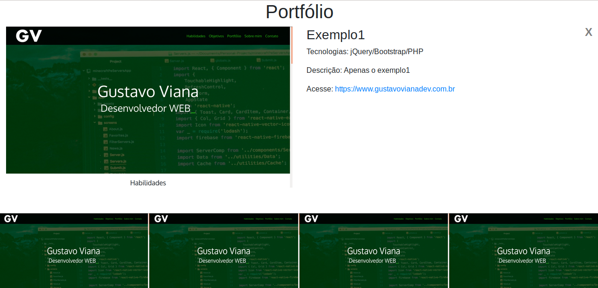
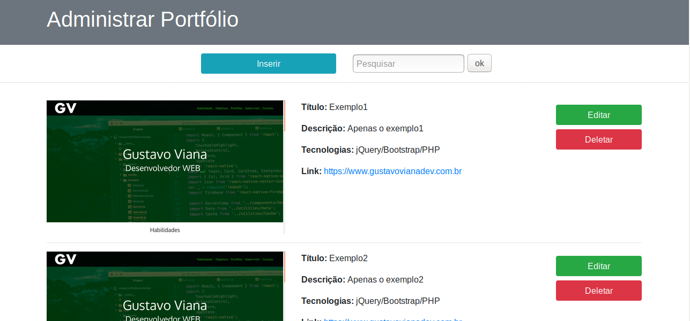

# Portfolio gerado dinamicamente

## Objetivo

Gerar uma página de portfólio com um determinado layout que obtêm itens cadastrados de um banco de dados. Separar as camadas cliente e servidor.

## Vantagens

É possível elaborar layouts diferentes apenas modificando o index.html. Ou então criando outras páginas de exibição.

## Metas

<ol>
<li>Painel administrativo, CRUD no banco de itens de portfólio.</li>
</ol>

### Detalhes

As consultas são feitas através de PDO em um banco MySQL, o resultado de uma consulta geral é gravada em um arquivo json. As classes e funções de consulta ficam na pasta server. A página index utiliza Ajax para executar a consulta no backend, depois através do arquivo json monta o layout da página.

### Banco de dados

O banco de dados deve ser criado executando criar_banco.sql

### Preview

#### Index

 

#### Clique no Item

 

#### Admin

 

